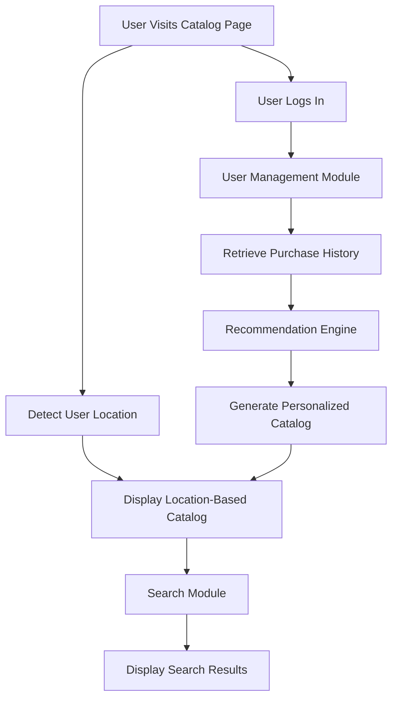

# Catalog System Design

This document outlines the design for an online product catalog system that adapts based on user location and purchase history, with integrated search functionality.

---

## Scenario Overview

- **Initial Display:**  
  The catalog initially shows products based on the user's geographical location.

- **Post-login Experience:**  
  Once a user logs in, the system updates the catalog to show personalized recommendations drawn from past purchase behavior.

- **Search Integration:**  
  The system includes a search functionality that allows users to query and filter products.

---

## 1. Modules Required for the System

### 1.1 User Management Module
- **Responsibilities:**
  - Handle user registration, authentication, and authorization.
  - Manage user profiles, including location and purchase history.
- **Key Functions:**
  - Register/login users.
  - Retrieve and update user preferences.

### 1.2 Catalog Module
- **Responsibilities:**
  - Display product listings based on geographic location.
  - Update product display based on user behavior after login.
- **Key Functions:**
  - Load and filter product data by region.
  - Integrate recommendations for a personalized catalog.

### 1.3 Recommendation Engine
- **Responsibilities:**
  - Analyze historical data and recommend products.
- **Key Functions:**
  - Process user behavior and purchase history.
  - Compute personalized product suggestions.

### 1.4 Search Module
- **Responsibilities:**
  - Allow users to search and filter products.
- **Key Functions:**
  - Index catalog data for searchability.
  - Return relevant results based on queries.

### 1.5 Integration Module
- **Responsibilities:**
  - Manage communication between front-end and back-end systems.
- **Key Functions:**
  - Handle API orchestration and module coordination.
  - Maintain smooth data flow across the system.

---

## 2. System Workflow Diagram

This Mermaid diagram outlines the user interaction flow across the system.

---

## 3. Conceptual Databases Involved

### 3.1 User Database
- **Purpose:**  
  Manage user information and behavior data.

- **Conceptual Contents:**  
  - User credentials (for authentication)  
  - Profile data (name, location, preferences)  
  - Purchase history  

### 3.2 Product Database
- **Purpose:**  
  Store and serve all product-related information.

- **Conceptual Contents:**  
  - Product details (ID, name, price, description, image)  
  - Product categories and metadata  
  - Location tags for geo-based filtering  

### 3.3 Recommendation Data Store
- **Purpose:**  
  Support recommendation generation and storage.

- **Conceptual Contents:**  
  - Historical transaction logs  
  - User-product interaction metrics  
  - Precomputed recommendation results  

### 3.4 Search Index Database
- **Purpose:**  
  Optimize search queries and indexing.

- **Conceptual Contents:**  
  - Indexed product data (title, keywords, descriptions)  
  - Metadata for ranking and filtering  
  - Search history (optional for analytics)
